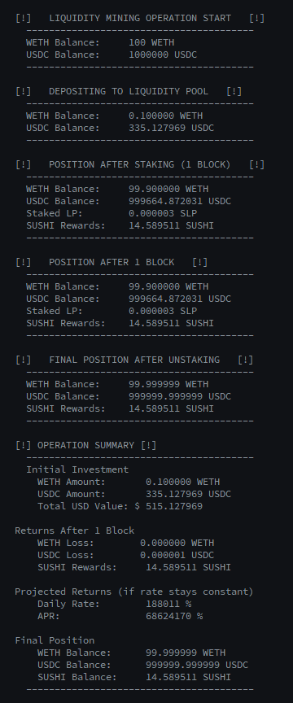
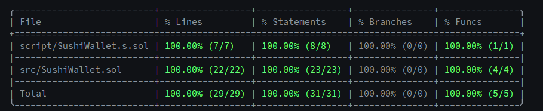
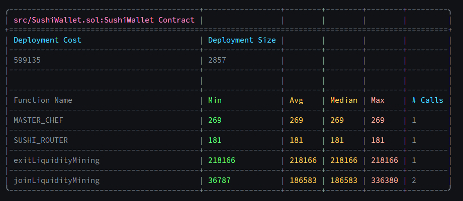

# SushiWallet Encapsulation

> A gas-optimized contract for managing SushiSwap liquidity positions and yield farming in a single transaction.

## Table of Contents

- [Features](#features)
- [Technical Details](#technical-details)
  - [Architecture](#architecture)
  - [Security](#security)
  - [Development](#development)
- [Testing](#testing)
  - [Full Cycle Output](#full-cycle-output)
  - [Coverage Report](#coverage-report)
  - [Gas Analysis](#gas-analysis)
- [License](#license)

## Features

- 🔄 Single-transaction liquidity provision and staking
- 💰 Automated yield farming setup
- ⚡ Gas-optimized operations
- 🔒 Non-custodial design
- 🛡️ Built-in slippage protection
- 🚀 Streamlined LP token management

## Technical Details

### Architecture

The contract operates through two main functions:

1. **Join Liquidity Mining**:

   - Transfers tokens from user
   - Adds liquidity to SushiSwap
   - Stakes LP tokens in MasterChef (V1 or V2)

2. **Exit Liquidity Mining**:
   - Withdraws from MasterChef (V1 or V2)
   - Removes liquidity from SushiSwap
   - Returns tokens to user

### Security

- ✓ Non-custodial design
- ✓ Slippage protection
- ✓ Deadline checks
- ✓ SafeERC20 implementation
- ✓ No admin privileges
- ✓ Immutable addresses

### Development

```bash
# Install dependencies
forge install

# Run tests
forge test
forge test --gas-report

# Check test coverage
forge coverage

# Deploy to Arbitrum
forge script script/SushiWallet.s.sol:SushiWalletScript \
    --rpc-url $ARBITRUM_RPC_URL \
    --broadcast \
    --verify \
    --etherscan-api-key $ARBISCAN_API_KEY \
    --private-key $PRIVATE_KEY \
    -vvvv
```

## Testing

### Full Cycle Output



### Coverage Report



### Gas Analysis



## License

MIT License - see [LICENSE.md](LICENSE.md)
